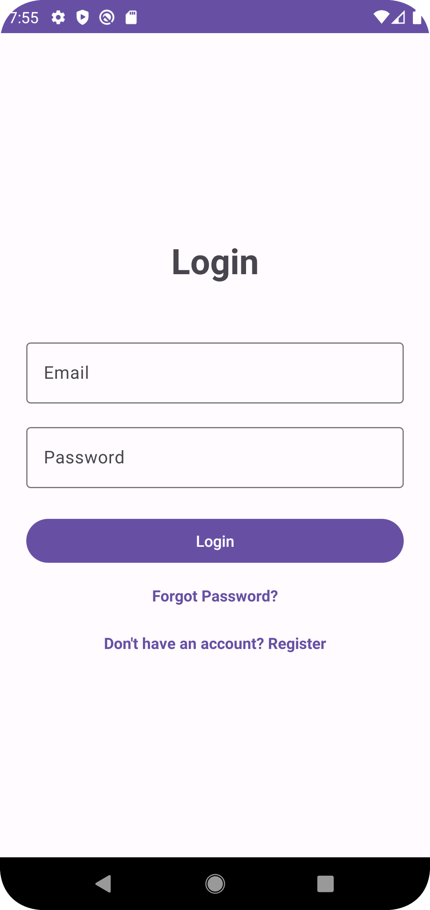
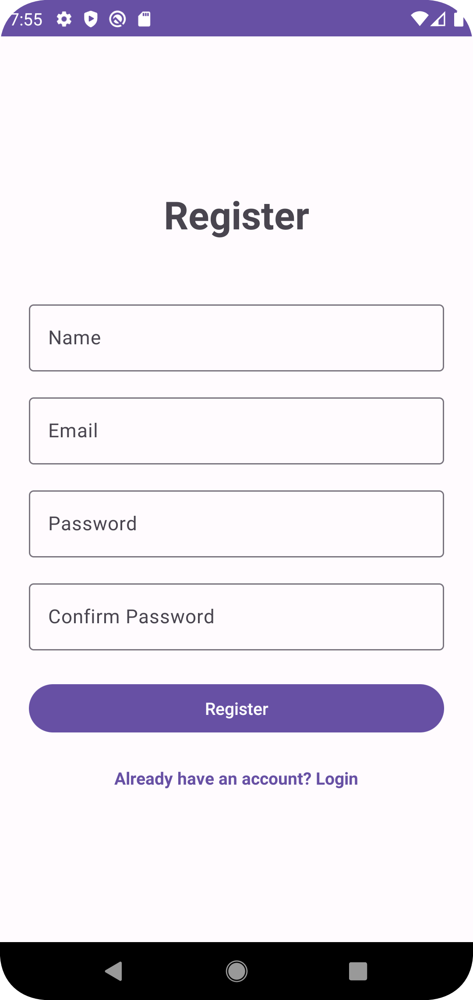
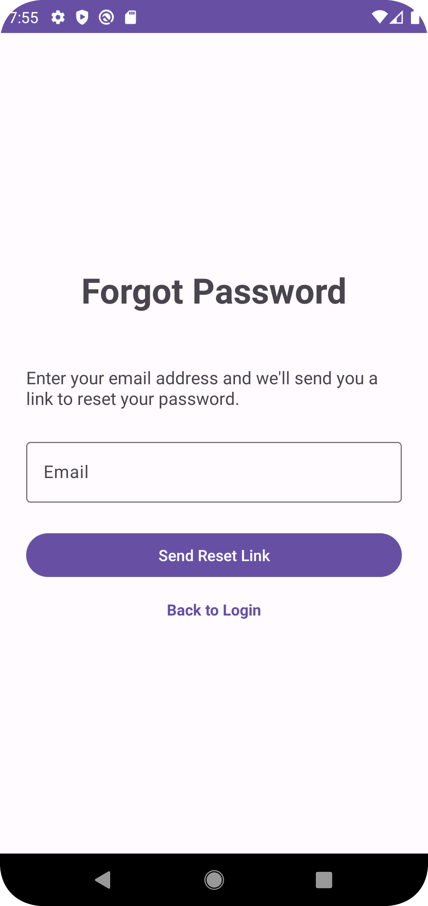
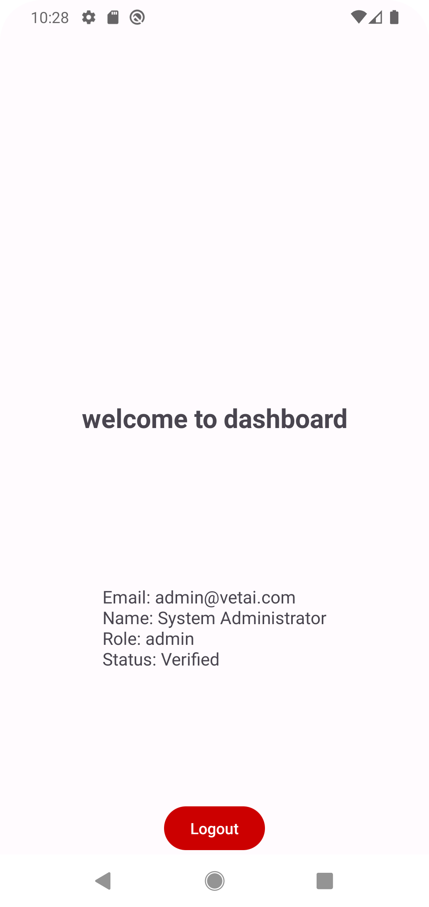

# Auth Client Kotlin Android App

A modern Android application for authentication client functionality. Built with Kotlin and following MVVM architecture patterns for robust, scalable mobile development.

**Current Status**: Authentication system fully implemented with complete user registration, login, password recovery, and session management features.

## ✨ Features

### 🔐 Authentication System
- **User Registration** - Create new accounts with email and password
- **Secure Login** - Authenticate users with JWT tokens
- **Password Recovery** - Forgot password with email reset links
- **Password Reset** - Secure password reset with tokens
- **Email Verification** - Account verification via email
- **Session Management** - Automatic token refresh and session handling
- **Logout** - Secure logout with token cleanup

### 🏗️ Architecture
- **MVVM Pattern** - Clean separation of concerns
- **Repository Pattern** - Centralized data management
- **Retrofit** - HTTP client for API communication
- **View Binding** - Type-safe view access
- **LiveData** - Reactive UI updates
- **Coroutines** - Asynchronous operations

### 🛠️ Technology Stack
- **Language**: Kotlin
- **UI Framework**: Android Jetpack Components
- **Networking**: Retrofit 2 + OkHttp
- **Serialization**: Gson
- **Architecture**: MVVM with Repository pattern
- **Dependency Injection**: Manual (ViewModel Factory)
- **Database**: SharedPreferences (for token storage)
- **Build System**: Gradle with Kotlin DSL

## 🚀 API Endpoints

| Method | Endpoint | Description | Auth Required |
|--------|----------|-------------|---------------|
| POST | `/api/v1/auth/register` | Register new user | ❌ |
| POST | `/api/v1/auth/login` | User login | ❌ |
| POST | `/api/v1/auth/logout` | User logout | ✅ |
| DELETE | `/api/v1/auth/logout` | Alternative logout | ✅ |
| POST | `/api/v1/auth/refresh-token` | Refresh access token | ❌ |
| POST | `/api/v1/auth/forgot-password` | Request password reset | ❌ |
| POST | `/api/v1/auth/reset-password` | Reset password with token | ❌ |
| POST | `/api/v1/auth/verify-email` | Verify email with token | ❌ |
| POST | `/api/v1/auth/resend-verification` | Resend verification email | ❌ |
| GET | `/api/v1/auth/session` | Check current session | ✅ |
| GET | `/api/v1/auth/verify-token` | Verify token validity | ❌ |

### 📊 Data Models
- **User**: Profile information (id, email, username, role, verification status)
- **AuthResponse**: Login/registration response with tokens and user data
- **TokenData**: JWT access token with metadata
- **SessionResponse**: Current user session information
- **ApiResponse<T>**: Standardized API response wrapper

## 🏗️ Project Structure

```
.
├── .idea/                          # Android Studio IDE configuration
├── app/                            # Main application module
│   ├── src/
│   │   ├── androidTest/            # Instrumentation tests
│   │   ├── main/
│   │   │   ├── java/com/example/auth_client_kotlin_android_app/
│   │   │   │   ├── data/
│   │   │   │   │   ├── models/     # Data models (AuthModels.kt)
│   │   │   │   │   ├── network/    # Network layer (Retrofit, API service, TokenManager)
│   │   │   │   │   └── repository/ # Repository layer (AuthRepository.kt)
│   │   │   │   ├── ui/
│   │   │   │   │   ├── auth/       # Authentication UI
│   │   │   │   │   │   ├── AuthActivity.kt
│   │   │   │   │   │   ├── LoginFragment.kt
│   │   │   │   │   │   ├── RegisterFragment.kt
│   │   │   │   │   │   ├── ForgotPasswordFragment.kt
│   │   │   │   │   │   └── ResetPasswordFragment.kt
│   │   │   │   │   └── viewmodel/  # ViewModels (AuthViewModel.kt)
│   │   │   │   ├── utils/          # Utility classes (NetworkUtils.kt)
│   │   │   │   └── MainActivity.kt # Main entry point
│   │   │   ├── res/                # Resources (layouts, drawables, values)
│   │   │   └── AndroidManifest.xml # App manifest
│   │   └── test/                   # Unit tests
│   ├── build.gradle.kts            # App-level build configuration
│   └── proguard-rules.pro          # ProGuard rules
├── gradle/                         # Gradle wrapper
├── build.gradle.kts                # Project-level build configuration
├── settings.gradle.kts             # Project settings
└── gradlew                         # Gradle wrapper scripts
```

## 🛠️ Setup & Installation

### Prerequisites
- **Android Studio** (latest version recommended)
- **JDK 17** (required for compilation)
- **Android SDK** (API 29+ minimum)

### Getting Started

1. **Clone the repository**
   ```bash
   git clone <repository-url>
    cd auth-client-kotlin-android-app
   ```

2. **Open in Android Studio**
   - Launch Android Studio
   - Select "Open an existing Android Studio project"
   - Navigate to the cloned directory and select it

3. **Build the project**
   ```bash
   ./gradlew build
   ```

4. **Run on device/emulator**
   - Connect an Android device or start an emulator
   - Click the "Run" button in Android Studio or use:
   ```bash
   ./gradlew installDebug
   ```

## 📱 User Flow

### Authentication Flow
1. **App Launch** → **Login Screen**
2. **New User?** → **Registration** → Email verification
3. **Forgot Password?** → **Forgot Password** → Check email → **Reset Password**
4. **Login Success** → **Main App**

### Navigation
- **LoginFragment** - Email/password login with forgot password link
- **RegisterFragment** - New user registration
- **ForgotPasswordFragment** - Request password reset email
- **ResetPasswordFragment** - Enter token and new password
- **MainActivity** - Main app after successful authentication

## 🔧 Configuration

### Network Configuration
- Base URL and API endpoints configured in `RetrofitClient.kt`
- Network security config in `network_security_config.xml`
- Token management via `TokenManager.kt`

### Build Configuration
- **Min SDK**: API 29 (Android 10.0)
- **Target SDK**: API 36 (Android 16)
- **Compile SDK**: API 36
- **Java Version**: 17
- **Kotlin**: Latest stable

## 🧪 Testing

### Unit Tests
```bash
./gradlew testDebugUnitTest
```

### Instrumentation Tests
```bash
./gradlew connectedDebugAndroidTest
```

### Lint Check
```bash
./gradlew lintDebug
```

## 📦 Dependencies

### Core Android
- **AppCompat** - Backward compatibility
- **Material Components** - Material Design components
- **ConstraintLayout** - Flexible layouts
- **View Binding** - Type-safe view access

### Networking
- **Retrofit** - HTTP client
- **OkHttp** - HTTP client implementation
- **Gson** - JSON serialization

### Architecture
- **LiveData** - Observable data holder
- **ViewModel** - UI state management
- **Coroutines** - Asynchronous programming

## 🤝 Contributing

1. Fork the repository
2. Create a feature branch (`git checkout -b feature/amazing-feature`)
3. Commit your changes (`git commit -m 'Add amazing feature'`)
4. Push to the branch (`git push origin feature/amazing-feature`)
5. Open a Pull Request

## 📄 License

This project is licensed under the MIT License - see the LICENSE file for details.

## Screenshots

| Login Screen  | Registration   | Forgot Password |      Dashboard |
| :-----------: | :-----------:  | :-------------: | :------------: |
|  |  |  |  |